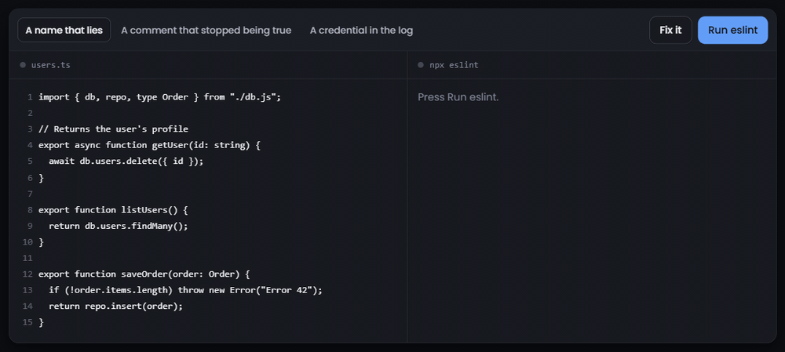

# eslint-plugin-jev

**Lint for meaning. ESLint rules that are plain-English questions, judged in ~100 ms by TypeSafe's Jev.**

Live demo: https://shahriarbijoy.github.io/eslint-plugin-jev/



Prettier fixes the shape of your code. ESLint matches it against known bad patterns. Neither one
ever asks what the code is *for*, so a function called `getUser` that deletes the user passes both
of them without a word.

This plugin adds the missing layer. A rule here is a sentence, not an AST visitor:

> *Does the function's name promise a different action than the body performs?*

Every function in the file is sent to [Jev](https://docs.typesafe.ai), a small model that answers a
question with a probability instead of a paragraph. `0.98` becomes a squiggle, `0.03` stays silent,
and the threshold that separates them lives in your ESLint config.

## Install

```bash
npm i -D @shahriarbijoy/eslint-plugin-jev @typescript-eslint/parser   # only if you lint TypeScript
echo 'TYPESAFE_API_KEY=...' >> .env                    # get a key from the TypeSafe console: https://console.typesafe.ai
# echo 'OPENROUTER_API_KEY=...' >> .env                # alternative: a key from https://openrouter.ai/keys
```

With both keys set, TypeSafe is used unless `settings.jev.provider` says otherwise; with neither
set, the rules stay off and print one warning naming both `TYPESAFE_API_KEY` and
`OPENROUTER_API_KEY`.

The package is scoped because npm reserves unscoped names this close to `eslint-plugin-jest`. Rule ids are still `jev/name-matches-body` and friends.


```js
// eslint.config.js
import { defineConfig } from "eslint/config";
import tsParser from "@typescript-eslint/parser";
import jev from "@shahriarbijoy/eslint-plugin-jev";

export default defineConfig([
  { files: ["**/*.ts"], languageOptions: { parser: tsParser } }, // drop this line for plain JavaScript
  ...jev.configs.recommended,
]);
```

That is the whole setup. The three built-in rules run at `warn`. If no key is found, the rules stay
quiet and print one warning — a linter should never fail a build over a missing environment variable.

## What it catches

```ts
// examples/basic/src/users.ts
import { db, repo, type Order } from "./db.js";

// Returns the user's profile
export async function getUser(id: string) {
  await db.users.delete({ id });
}

export function listUsers() {
  return db.users.findMany();
}

export function saveOrder(order: Order) {
  if (!order.items.length) throw new Error("Error 42");
  return repo.insert(order);
}
```

Prettier says nothing. ESLint's own rules say nothing. Here is `npx eslint src/`:

```
src/users.ts
   3:1   warning  Comment on "getUser" describes behavior the code does not have (P=0.98, threshold 0.80)  jev/comment-matches-code
   4:23  warning  Name says "getUser" but the body mostly does "delete" (P=0.98, threshold 0.80)           jev/name-matches-body
  13:44  warning  Error message "Error 42" gives the reader nothing to act on (P=0.95, threshold 0.85)     jev/helpful-error-message

✖ 3 problems (0 errors, 3 warnings)
```

`listUsers` is clean and is not reported. The `getUser` warning comes with a quick fix that renames
it to `deleteUser`. The suggestion renames the declaration only; use your editor's Rename Symbol to
update call sites. In VS Code these are the same yellow squiggles you already have, in the same
places, for a new kind of reason.

You can run exactly this: [`examples/basic`](examples/basic) is a working project that lints the
file above as soon as you drop in your own key.

## Rules

| Rule | What it asks | Default threshold | Docs |
| --- | --- | --- | --- |
| `jev/name-matches-body` | Does the name promise a different action, object, or result than the body performs? | 0.80 | [docs](docs/rules/name-matches-body.md) |
| `jev/comment-matches-code` | Does the leading comment describe behavior the body does not have, or hide a side effect it does? | 0.80 | [docs](docs/rules/comment-matches-code.md) |
| `jev/helpful-error-message` | Would a developer reading this thrown message in a log be unable to tell what went wrong? | 0.85 | [docs](docs/rules/helpful-error-message.md) |
| `jev/check` | Your own question, one sentence, asked of every function. | 0.80 | [docs](docs/rules/check.md) |

The threshold is the probability at which a rule speaks up. Raise it to hear less, lower it to hear
more. Every message prints both the probability and the threshold so you can tune from real output.

`jev.configs.recommended` turns the first three on at `warn`. Promote them to `error` once you have
seen how they behave on your code:

```js
rules: {
  "jev/name-matches-body": ["error", { threshold: 0.9 }],
}
```

## Write your own rule

`jev/check` takes a list of questions. Each one gets an `id` (used in the message), the question
itself, and optionally its own threshold. No parser, no AST, no regex.

```js
// eslint.config.js
import { defineConfig } from "eslint/config";
import jev from "@shahriarbijoy/eslint-plugin-jev";

export default defineConfig([
  // ...the parser block from Install goes here
  ...jev.configs.recommended,
  {
    settings: { jev: { model: "jev-1.13.0" } },
    rules: {
      "jev/name-matches-body": "error",
      "jev/check": ["warn", {
        checks: [
          { id: "no-secret-logging",
            question: "Does this function log, print, or put into an error message anything that looks like a secret, token, password, or API key?" },
          { id: "user-facing-copy", threshold: 0.85,
            question: "Does this function build a message shown to end users that contains internal jargon, stack traces, or identifiers a user would not understand?" },
        ],
      }],
    },
  },
]);
```

A flagged function reports at the line the model points to:

```
  41:1  warning  [no-secret-logging] Does this function log, print, or put into an error message anything that looks like a secret, token, password, or API key? Yes (P=0.97, threshold 0.80).  jev/check
```

Phrase the question so that **yes means the code is bad**. That is the only wording rule; see
[docs/rules/check.md](docs/rules/check.md) for how to write one that holds up.

## Measured on real code

Thresholds here are not guesses in a prompt, they are numbers you can re-measure. `bench/` holds
hand-labeled functions and a script that reports precision and recall per rule at each threshold.

Current numbers, model `jev-1.13.0`, from a **10-case seed set** for `name-matches-body`
(5 functions a human says should be flagged, 5 that should not):

| Threshold | Precision | Recall | Flagged |
| --- | --- | --- | --- |
| 0.60 | 1.00 | 1.00 | 5 |
| 0.70 | 1.00 | 1.00 | 5 |
| **0.80** (default) | **1.00** | **0.80** | 4 |
| 0.85 | 1.00 | 0.80 | 4 |
| 0.90 | 1.00 | 0.80 | 4 |
| 0.95 | 1.00 | 0.80 | 4 |

Ten cases, 4,766 input tokens, $0.0002 for the whole run. Read that honestly: it says nothing has
gone obviously wrong, not that precision is 1.00 on your codebase. `comment-matches-code` and
`helpful-error-message` have no label files yet, and the 50-case sets are still being labeled. The
full report is in [`bench/results/latest.md`](bench/results/latest.md); the method is in
[`bench/`](bench).

Speed, from a live run on a 3-function file: **934 ms cold and 13 ms on the rerun in the run
recorded for the demo**, because every answer is cached on disk by content hash. Only functions you
edited are ever asked again.

## Settings

Everything below is optional. Put it under `settings.jev` in any config object:

```js
settings: {
  jev: {
    model: "jev-latest",     // pin a version once thresholds are tuned
    timeoutMs: 8000,         // per file, across all its functions; on timeout the file is skipped
    maxFunctionTokens: 6000, // estimated at 4 chars/token; larger functions are skipped with a diagnostic
    concurrency: 6,          // parallel Jev requests per file
    cacheDir: "node_modules/.cache/eslint-plugin-jev",
    strict: false,           // true: a missing key or transport failure is reported as a lint problem at line 1, at the rule's configured severity
    ignoreNames: ["^use[A-Z]", "^on[A-Z]", "^handle[A-Z]", "^toJSON$"],  // regexes, for name-matches-body
    provider: "auto",        // "auto" (default) | "typesafe" | "openrouter" — which backend answers questions
  }
}
```

TypeScript users can type the block with `JevSettings` from the package.

`provider: "auto"` uses TypeSafe when `TYPESAFE_API_KEY` is set and falls back to OpenRouter
otherwise; `"typesafe"` and `"openrouter"` pin one backend regardless of which keys are present.
Through OpenRouter the model id is sent unchanged, so use `jev-latest` or an OpenRouter id such as
`typesafe/jev-1.13`; TypeSafe's three-part ids such as `jev-1.13.0` are TypeSafe-only. OpenRouter's
Decisions endpoint is currently in beta. The model's listed per-token price is
the same through either route, and OpenRouter's own credit fees are separate. Through TypeSafe that
price is $0.042 per million input tokens, output free.

`strict` does not change severity. Under the recommended config the report is a warning; set the
jev rules to `"error"` in your config if you want a missing key to fail CI. Without `strict`, the
plugin prints one console warning per process and stays silent.

The cache is keyed by the backend that answered and the model id you configure. Switching
`provider`, or upgrading from 0.1.0, refetches everything once because the old entries were keyed
without a backend. `jev-latest` answers stay cached after the alias moves; pin a version (for
example `jev-1.13.0`) or delete `node_modules/.cache/eslint-plugin-jev` to refresh.

`ignoreNames` exists because `useSomething`, `onSomething` and `toJSON` are named by convention
rather than by what they do, and the model is right to find them odd.

In CI, cache `node_modules/.cache/eslint-plugin-jev` between runs alongside ESLint's own `--cache`.
Unchanged functions then cost nothing.

### Where the key comes from

Each key is looked up independently, in this order, first hit wins:

1. in the environment
2. in a `.env` file in the directory ESLint runs from
3. in `~/.config/jev/config.json`, under `apiKey` for TypeSafe or `openrouterApiKey` for OpenRouter

TypeSafe reads `TYPESAFE_API_KEY`; OpenRouter reads `OPENROUTER_API_KEY`. The key is read inside a
worker thread and never appears in a diagnostic, a log line, or the cache.

## Editor setup

The VS Code ESLint extension runs a language server that does **not** inherit your shell's
environment, so `TYPESAFE_API_KEY` exported in `.zshrc` will not reach it. That is why step 2 of
the install writes the key to `.env`: this plugin reads `.env` from the workspace root itself, so
VS Code works with no extra configuration.

If you keep your key somewhere else, hand it to the server directly:

```json
// .vscode/settings.json
{ "eslint.execArgv": ["--env-file=.env"] }
```

With no key found anywhere, the Jev rules produce no diagnostics at all. Your editor behaves
exactly as it did before you installed the plugin.

## Set up with an AI agent

If you work with a coding agent, hand it the prompt below instead of doing the install by hand. It
detects your package manager, edits the ESLint config in place, keeps your key out of git, and runs
the linter once so you see real output.

```
Set up eslint-plugin-jev in this repository.

1. Detect the package manager from the lockfile: pnpm-lock.yaml means pnpm,
   yarn.lock means yarn, otherwise npm.
2. Install @shahriarbijoy/eslint-plugin-jev as a dev dependency, plus eslint (^9 or ^10) if
   the repository does not already have it. If the repository contains any
   .ts files, also install @typescript-eslint/parser as a dev dependency.
3. If eslint.config.js, .mjs, .cjs or .ts exists, add
   `import jev from "@shahriarbijoy/eslint-plugin-jev";` at the top and spread
   `...jev.configs.recommended` after the existing entries (use `require`
   and `module.exports` instead if the file is CommonJS). If none exists,
   create eslint.config.mjs containing:
     import jev from "@shahriarbijoy/eslint-plugin-jev";
     export default [...jev.configs.recommended];
   Only if the repository has .ts files, also add
   `import tsParser from "@typescript-eslint/parser";` and put
   `{ files: ["**/*.ts"], languageOptions: { parser: tsParser } }` before
   the spread.
4. If the user gave you a TypeSafe key, append TYPESAFE_API_KEY=<key> to .env
   in the directory ESLint runs from (normally the repository root). If they
   gave you an OpenRouter key instead, append OPENROUTER_API_KEY=<key> there.
   Otherwise add both TYPESAFE_API_KEY= and OPENROUTER_API_KEY= to
   .env.example, and tell the user to get a TypeSafe key at
   https://console.typesafe.ai or an OpenRouter key at https://openrouter.ai/keys,
   then put that key in .env.
5. Make sure .env is listed in .gitignore. Add it if it is missing.
6. Run `npx eslint <one source file>` and paste the warnings verbatim. If it
   prints nothing and no key was given, say the rules are inactive until a
   key is set.
7. Never commit .env. Never print the key.
8. Report what you changed in five lines.
```

The same text lives in [`docs/agent-setup.md`](docs/agent-setup.md), and the
[site](https://shahriarbijoy.github.io/eslint-plugin-jev/#agent) has a copy-paste button for it.

## How it works

ESLint already walks every function in the file, so the plugin collects them, bundles all the
enabled rules' questions into one request per function, and runs up to six of those at a time in a
worker thread — ESLint rules are synchronous, so the worker is what makes an API call possible
inside one. One round trip per function, 100 to 300 ms each, six in flight. Jev answers each
question with a probability; the rule compares it to the threshold and reports at the name, the
comment, or the throwing line. Every answer is written to a content-hashed cache on disk, which is
why the second run costs nothing and takes milliseconds.

Jev is TypeSafe's small judgment model: you give it some state and a question, and it gives you a
probability rather than prose. It is documented at [docs.typesafe.ai](https://docs.typesafe.ai).

## What it is not

- **Not for anything countable.** Function length, cyclomatic complexity, unused variables — a
  normal ESLint rule already does those, exactly, for free. Keep them.
- **Not offline, and not private.** It needs the network and a key, and the functions it lints are
  sent to TypeSafe's API — name, signature, leading comment and body, one function at a time, no
  surrounding file. Without a key or a network it disables itself silently. Scope it away from
  anything you cannot send: `{ ignores: ["src/secrets/**"] }`.
- **Not exhaustive about failures.** A function whose request hits a rate limit, the per-file
  deadline, or the token budget is skipped without a diagnostic; only a missing or rejected key and
  network failures are reported.
- **Not an autofixer.** A judgment with a probability attached is not something to apply to your
  source automatically. `name-matches-body` offers a rename as a *suggestion* you accept by hand;
  nothing changes under `--fix`.
- **Not a proof.** It judges. That is why it defaults to `warn` and prints the number it judged on.

## Cost

Input tokens are $0.042 per million and output is free. One function is typically 100 to 400 tokens
plus about 80 per question, so a 200-function repository costs well under a cent to lint cold, and
nothing at all warm — the cache means you only pay for functions you changed. The seed benchmark
above, 10 functions from scratch, cost $0.0002.

## Contributing

Bug reports, rule ideas and better question wording are all welcome. The tests run offline with no
API key: `pnpm install && pnpm test`. See [CONTRIBUTING.md](CONTRIBUTING.md).

## License

[MIT](LICENSE)
